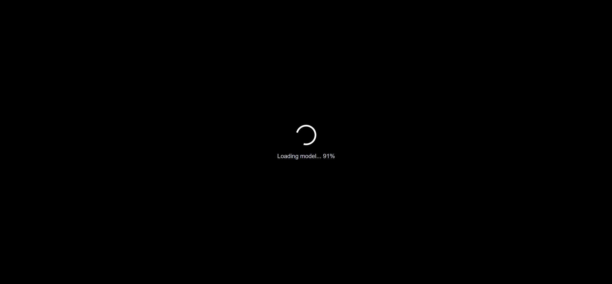
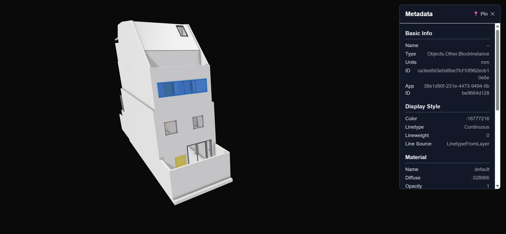
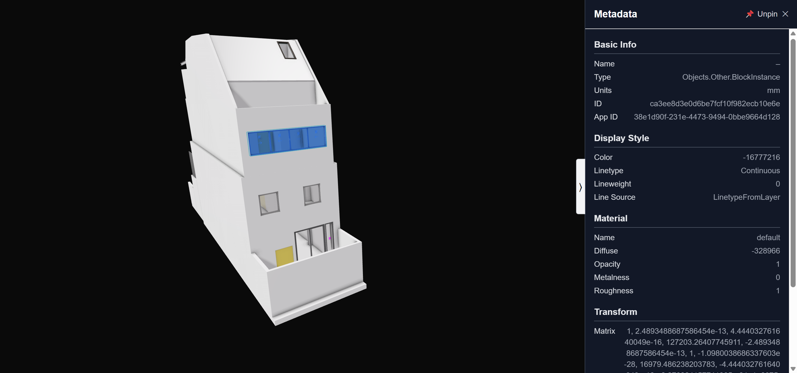
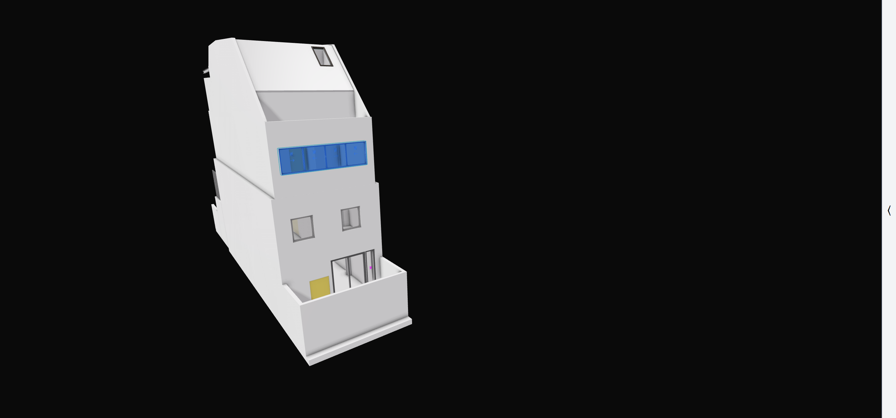

# Enhanced Speckle Viewer

An improved Speckle viewer built with Next.js and Tailwind CSS. It replicates the core functionality of the official viewer while enhancing UI/UX through a dark-themed metadata sidebar, interactive component selection, and polished design improvements.

## 🔗 Live Demo

👉 [https://enhanced-speckle-viewer.vercel.app](https://enhanced-speckle-viewer.vercel.app)

## 🧠 Approach
This project enhances the Speckle Viewer experience by refining how metadata is surfaced and interacted with. The improvements prioritize:
- Clarity: Metadata is grouped into clearly defined sections in a persistent sidebar layout
- Responsiveness: Users can collapse or pin the sidebar to suit their viewing needs
- Feedback: A loading spinner with real-time progress keeps users informed during model loading
- Accessibility: Dark mode styling ensures comfortable viewing and reduces eye strain

## ✨ Features

- ✅ Recreated 3D model viewer using Speckle’s open-source viewer
- 🧱 Clickable components with a rich metadata sidebar
- 📌 Pin & collapse sidebar for flexible viewing
- 🌘 Dark-themed interface for better readability
- ⏳ Animated spinner loader with real-time model loading progress
- 🎯 Metadata persists when sidebar is pinned
- 📜 Metadata display scrolls to top on selection
- 🔐 Type-safe schema validation with Zod

## 💡 UI/UX Improvements

Compared to the original Speckle viewer:

- Refined Metadata Display: Replaced the default accordion layout with a structured sidebar, designed for improved readability and efficient information scanning
- Persistent Metadata Sidebar: Enabled pinning of the metadata sidebar, allowing users to keep important information visible while navigating the 3D model
- Selection Persistence: When users click outside the model, the pinned sidebar retains metadata of the last selected component, preventing unwanted sidebar dismissal
- Collapsible Sidebar: Added a collapse toggle to reduce visual clutter and offer a more focused viewing experience when needed
- Improved Loading Feedback: Introduced a centered loading spinner with a real-time percentage indicator to provide clear and immediate feedback during model loading (instead of the subtle default progress bar in the original Speckle viewer)

## 🚀 Possible Future Improvements
- Metadata Search & Filtering: Implement a search bar and filter controls to allow users to quickly locate relevant metadata fields
- Draggable Sidebar: Enable users to reposition the metadata sidebar for greater layout flexibility and personalization
- Multi-Component Metadata Display: Support simultaneous display of metadata from multiple selected components for side-by-side comparison
- Multi-Model Support: Allow loading, switching, and managing multiple Speckle models within the same session
- Interactive Model Editing: Add tools for selecting, highlighting, or editing components directly within the viewer
- Enhanced Nested Metadata UX: Improve the user interface to better handle large or deeply nested metadata structures, ensuring intuitive navigation and display
- Standardized Metadata Parsing: Create a robust, flexible parser to gracefully handle possible structural inconsistencies across new Speckle models
- Responsive Design: Ensure a seamless and adaptive experience across various devices, including tablets and mobile phones.

## 🛠️ Tech Stack

- [Next.js 14](https://nextjs.org)
- [React](https://react.dev)
- [Tailwind CSS](https://tailwindcss.com)
- [TypeScript](https://www.typescriptlang.org)
- [Zod](https://zod.dev) for metadata schema validation
- [@speckle/viewer](https://github.com/specklesystems)

## 📸 Screenshots

Below are some key interface states captured from the deployed viewer:

| Loading Spinner with Progress | Floating Sidebar (Unpinned) |
|------------------------------|----------------|
|  |  |

| Pinned Sidebar | Collapsed Sidebar |
|-----------------------------|-------------------|
|  |  |

> 📝 _All screenshots are taken from the [live deployment](https://enhanced-speckle-viewer.vercel.app). For full interactivity, please explore the project directly._

## 📄 License

MIT
